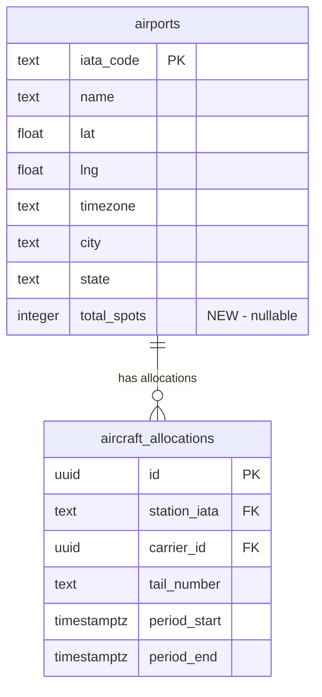

# feat: Station Capacity Tracking

## Overview

Add station capacity tracking to the aircraft allocation map. Each station will have a `total_spots` field indicating maximum aircraft capacity. Display available spots and show warnings when stations are at or over capacity.

**Key behaviors:**
- Available spots = `total_spots - allocations.length` (calculated client-side from existing data)
- Time-aware: uses allocations already filtered by the timeline slider
- Soft limit: warn but allow allocation when at/over capacity
- Configure capacity via Supabase dashboard (admin UI deferred)

## Problem Statement

Users have no visibility into whether a station can accommodate additional aircraft, leading to overcrowded stations without warning.

## Proposed Solution

Leverage existing data flow. The `useStationAllocations` hook already fetches all allocations for a station at a given time. Capacity is simply `total_spots - allocations.length`. No new hooks, database functions, or subscriptions needed.

## Technical Approach

### Phase 1: Database Schema

**Migration: `add_station_capacity.sql`**

```sql
-- Add capacity column to airports
ALTER TABLE airports
ADD COLUMN total_spots integer DEFAULT NULL
CONSTRAINT check_total_spots_non_negative CHECK (total_spots IS NULL OR total_spots >= 0);
```

That's it. One column.

### Phase 2: TypeScript Types

**File: `src/types/database.ts`**

Update the Database interface to include `total_spots`:

```typescript
// In Database['public']['Tables']['airports']['Row']
total_spots: number | null
```

### Phase 3: StationDrawer Capacity Display

**File: `src/components/StationDrawer.tsx`**

Add capacity display to the summary section (around line 189-209):

```typescript
// After existing hooks
const { data: allocations } = useStationAllocations(stationIata, viewTime)

// Inline calculation - no new hook needed
const totalSpots = airport?.total_spots
const occupiedSpots = allocations?.length || 0
const isAtCapacity = totalSpots !== null && occupiedSpots >= totalSpots
const isOverCapacity = totalSpots !== null && occupiedSpots > totalSpots

// In the summary section JSX
{totalSpots !== null && (
  <div className="mt-3 pt-3 border-t border-gray-200">
    <div className={cn(
      'flex items-center gap-2 text-sm',
      isOverCapacity && 'text-red-600',
      isAtCapacity && !isOverCapacity && 'text-amber-600'
    )}>
      <span className="font-medium">
        {occupiedSpots} of {totalSpots} spots
      </span>
      {isOverCapacity && (
        <span className="px-2 py-0.5 bg-red-100 rounded text-xs">
          {occupiedSpots - totalSpots} over capacity
        </span>
      )}
      {isAtCapacity && !isOverCapacity && (
        <span className="px-2 py-0.5 bg-amber-100 rounded text-xs">
          At capacity
        </span>
      )}
    </div>
  </div>
)}
```

### Phase 4: AllocationDialog Warning

**File: `src/components/AllocationDialog.tsx`**

Add capacity warning before the submit button (around line 450):

```typescript
// Get capacity info (pass as props from parent or fetch airport)
const totalSpots = airport?.total_spots
const currentCount = existingAllocations?.length || 0
const willExceedCapacity = totalSpots !== null && currentCount >= totalSpots

// Before submit button in JSX
{willExceedCapacity && !allocation && (
  <div className="flex items-center gap-2 p-3 bg-amber-50 border border-amber-200 rounded-lg text-sm">
    <svg className="w-4 h-4 text-amber-600 shrink-0" fill="none" stroke="currentColor" viewBox="0 0 24 24">
      <path strokeLinecap="round" strokeLinejoin="round" strokeWidth={2} d="M12 9v2m0 4h.01m-6.938 4h13.856c1.54 0 2.502-1.667 1.732-3L13.732 4c-.77-1.333-2.694-1.333-3.464 0L3.34 16c-.77 1.333.192 3 1.732 3z" />
    </svg>
    <span className="text-amber-800">
      Station is at capacity ({currentCount}/{totalSpots} spots). You can still add this aircraft.
    </span>
  </div>
)}
```

## Acceptance Criteria

### Schema
- [x] `airports.total_spots` column exists (integer, nullable, default NULL)
- [x] CHECK constraint prevents negative values
- [x] Existing airports have NULL capacity (unlimited)

### Capacity Display
- [x] StationDrawer shows "X of Y spots" when `total_spots` is configured
- [x] Capacity hidden when `total_spots` is NULL
- [x] Amber indicator when at capacity (X = Y)
- [x] Red indicator when over capacity (X > Y)

### Soft Limit Warning
- [x] AllocationDialog shows warning when adding to station at/over capacity
- [x] Warning does not block form submission
- [x] Warning only shows for new allocations, not edits

### Configuration
- [x] Capacity can be set via Supabase dashboard
- [x] NULL means unlimited (no display, no warning)
- [x] Zero means always at capacity

## ERD



## Edge Cases

| Scenario | Behavior |
|----------|----------|
| `total_spots = NULL` | Capacity display hidden, no warnings |
| `total_spots = 0` | Always "at capacity", warning shown |
| `total_spots = 5`, `occupied = 7` | Red: "7 of 5 spots (2 over capacity)" |
| Editing existing allocation | No warning (not adding new aircraft) |

## Testing

- [x] Capacity displays correctly in StationDrawer
- [x] Warning shows in AllocationDialog when at/over capacity
- [x] No warning when `total_spots` is NULL
- [x] Capacity updates when timeline slider moves (existing behavior)

## Implementation Order

1. **Database migration** - Add `total_spots` column
2. **TypeScript types** - Update Airport interface
3. **StationDrawer** - Add capacity display (~15 lines)
4. **AllocationDialog** - Add warning (~10 lines)

**Total estimated code: ~25-30 lines**

## Future Enhancements (Deferred)

These were in the original plan but removed per reviewer feedback (YAGNI):

- ~~Admin UI for configuring capacity~~ - **IMPLEMENTED** at `/admin`
- Real-time subscription for capacity changes (capacity rarely changes)
- Audit columns for tracking who changed capacity
- Map marker indicators for at-capacity stations
- Separate `useStationCapacity` hook (derive from existing data instead)

Add these when users actually request them.

## References

### Internal
- `src/hooks/useAllocations.ts:153-211` - `useStationAllocations` already fetches filtered allocations
- `src/components/StationDrawer.tsx:189-209` - Summary section to add capacity display
- `src/components/AllocationDialog.tsx:450+` - Where to add warning

### Reviewer Feedback Applied
- DHH: "The data is already there. Don't build infrastructure for arithmetic."
- Kieran: "Calculate capacity client-side from the allocation data you already have."
- Simplicity: "~15 lines of code vs ~400 lines in the original plan."
