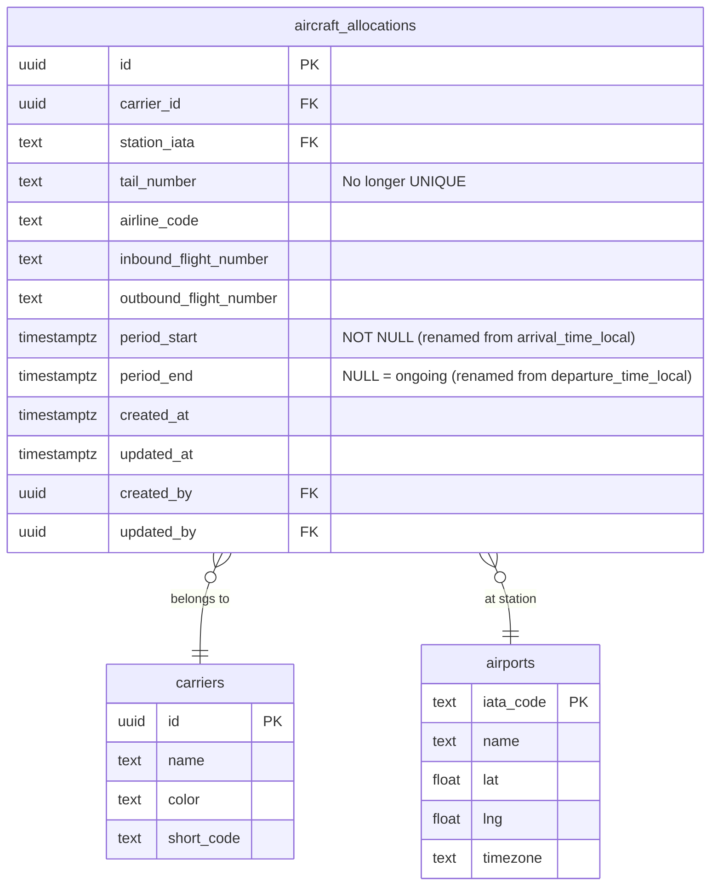

# feat: Time-Based Aircraft Allocations

> **Revised**: Incorporates feedback from DHH, Kieran, and Simplicity reviewers.

## Overview

Enable carriers to allocate aircraft to multiple stations during distinct time periods. For example, aircraft N123 can be at DFW from 1-9pm on Saturday, then at CLT from 9:01pm onward. Users can visualize how aircraft storage changes over time using a timeline slider and manage allocations through a fixed-width side panel.

## Problem Statement / Motivation

Currently, the system enforces a `UNIQUE` constraint on `tail_number`, meaning each aircraft can only have one active allocation at a time. This prevents:

- **Planning future allocations** - Cannot schedule where aircraft will be tomorrow
- **Historical tracking** - Cannot see where aircraft was yesterday
- **Time-based analysis** - Cannot visualize how station utilization changes throughout the day

Carriers need to manage aircraft movements across time to optimize ground operations, plan maintenance windows, and coordinate with station staff.

## Proposed Solution

### High-Level Approach

1. **Schema Evolution**: Rename existing time columns, remove unique constraint, add exclusion constraint
2. **Timeline Slider**: Add scrubbing control to filter map view by selected point in time
3. **Aircraft Panel**: Fixed-width side panel showing all time periods for a selected aircraft
4. **Query Modifications**: Filter all allocation queries by "active at time X"

### User Experience

```
┌─────────────────────────────────────────────────────────────────────┐
│  CommandBar (search, filters)                                       │
├─────────────────────────────────────────────────────────────────────┤
│                                                                     │
│                        MAP VIEW                                     │
│    (ring markers show allocations active at selected time)          │
│                                                                     │
├─────────────────────────────────────────────────────────────────────┤
│  [2026-01-22]  00:00 ────●──────────────────── 23:59  14:30  [Now]  │
└─────────────────────────────────────────────────────────────────────┘
```

When user clicks an aircraft tail number:

```
┌─────────────────────────────────────────────────────────────────────┐
│  MAP (flex-1)                      │  AIRCRAFT PANEL (w-96 fixed)   │
│                                    │  ┌─────────────────────────┐   │
│                                    │  │ N123 - American Airlines│   │
│                                    │  ├─────────────────────────┤   │
│                                    │  │ DFW  Jan 22, 9am-1pm  ✕│   │
│                                    │  │ CLT  Jan 22, 5pm-9pm  ✕│   │
│                                    │  │ + Add Time Period       │   │
│                                    │  └─────────────────────────┘   │
└─────────────────────────────────────────────────────────────────────┘
```

---

## Design Decisions (Closed)

These were originally open questions. All are now finalized:

| Decision | Choice | Rationale |
|----------|--------|-----------|
| Touching periods allowed? | **Yes** | Using `[)` interval bounds (start inclusive, end exclusive). `[9am,5pm)` and `[5pm,9pm)` do NOT overlap. |
| Same aircraft at two stations simultaneously? | **No** | Physical impossibility. Single exclusion constraint on `tail_number` enforces this. |
| Can users edit past allocations? | **Yes** | Allows data correction. `updated_at`/`updated_by` provides audit trail. |
| Timezone for input? | **Station local time, stored UTC** | Consistent with current behavior. |
| Default timeline range? | **Current day (00:00-23:59)** | Most common use case is daily operations. |

---

## Technical Approach

### Phase 1: Database Schema Changes

#### 1.1 Migration: Rename Columns and Add Constraints

**File: `supabase/migrations/YYYYMMDDHHMMSS_time_based_allocations.sql`**

```sql
-- Step 1: Rename existing columns (no data duplication)
ALTER TABLE aircraft_allocations
  RENAME COLUMN arrival_time_local TO period_start;
ALTER TABLE aircraft_allocations
  RENAME COLUMN departure_time_local TO period_end;

-- Step 2: Make period_start NOT NULL (should already have data)
ALTER TABLE aircraft_allocations
  ALTER COLUMN period_start SET NOT NULL;

-- Step 3: Remove the UNIQUE constraint on tail_number
ALTER TABLE aircraft_allocations
  DROP CONSTRAINT IF EXISTS aircraft_allocations_tail_number_key;

-- Step 4: Add btree_gist extension for exclusion constraint
CREATE EXTENSION IF NOT EXISTS btree_gist;

-- Step 5: Add exclusion constraint to prevent overlapping periods
-- Uses [) semantics: inclusive start, exclusive end
ALTER TABLE aircraft_allocations
  ADD CONSTRAINT no_overlapping_periods
  EXCLUDE USING GIST (
    tail_number WITH =,
    tstzrange(period_start, period_end, '[)') WITH &&
  );

-- Step 6: Add GiST index for time-based queries
CREATE INDEX idx_allocations_period
  ON aircraft_allocations
  USING GIST (tstzrange(period_start, period_end, '[)'));

-- Step 7: Add B-tree index for tail_number lookups
CREATE INDEX idx_allocations_tail_number
  ON aircraft_allocations (tail_number);
```

#### 1.2 Update View: allocations_with_ground_time

The view continues to work after column rename. Update the function call:

```sql
-- Update view to use renamed columns
CREATE OR REPLACE VIEW allocations_with_ground_time AS
SELECT
  a.*,
  c.name as carrier_name,
  c.color as carrier_color,
  c.short_code as carrier_short_code,
  ap.name as airport_name,
  ap.timezone as airport_timezone,
  compute_ground_time_minutes(a.period_start, a.period_end, ap.timezone) as ground_time_minutes
FROM aircraft_allocations a
JOIN carriers c ON a.carrier_id = c.id
JOIN airports ap ON a.station_iata = ap.iata_code;
```

### Phase 2: TypeScript Types

**File: `src/types/database.ts` (additions)**

```typescript
// Update the Tables interface for aircraft_allocations
export interface AircraftAllocationRow {
  id: string
  carrier_id: string
  station_iata: string
  tail_number: string
  airline_code: string | null
  inbound_flight_number: string | null
  outbound_flight_number: string | null
  period_start: string      // Renamed from arrival_time_local
  period_end: string | null // Renamed from departure_time_local
  created_at: string
  updated_at: string
  created_by: string | null
  updated_by: string | null
}

// Form data for creating/editing allocations
export interface AllocationFormData {
  carrier_id: string
  station_iata: string
  tail_number: string
  airline_code: string
  inbound_flight_number: string
  outbound_flight_number: string
  period_start: string
  period_end: string
}

// Overlap validation result
export interface OverlapCheckResult {
  hasOverlap: boolean
  conflictingAllocation?: {
    id: string
    station_iata: string
    period_start: string
    period_end: string | null
  }
}
```

### Phase 3: Timeline Slider Component

#### 3.1 Debounced Value Hook

**File: `src/hooks/useDebouncedValue.ts`**

```typescript
import { useState, useEffect } from 'react'

export function useDebouncedValue<T>(value: T, delay: number): T {
  const [debouncedValue, setDebouncedValue] = useState(value)

  useEffect(() => {
    const timer = setTimeout(() => setDebouncedValue(value), delay)
    return () => clearTimeout(timer)
  }, [value, delay])

  return debouncedValue
}
```

#### 3.2 TimelineSlider Component

**File: `src/components/TimelineSlider.tsx`**

```tsx
'use client'

import { DateTime } from 'luxon'
import { useCallback } from 'react'

interface TimelineSliderProps {
  viewTime: DateTime
  onViewTimeChange: (time: DateTime) => void
}

export function TimelineSlider({ viewTime, onViewTimeChange }: TimelineSliderProps) {
  const dayStart = viewTime.startOf('day')
  const totalMinutes = 24 * 60
  const currentMinutes = viewTime.diff(dayStart, 'minutes').minutes

  // Slider changes time-of-day, preserves date
  const handleSliderChange = useCallback((e: React.ChangeEvent<HTMLInputElement>) => {
    const minutes = Number(e.target.value)
    onViewTimeChange(dayStart.plus({ minutes }))
  }, [dayStart, onViewTimeChange])

  // Date picker changes date, preserves time-of-day
  const handleDateChange = useCallback((e: React.ChangeEvent<HTMLInputElement>) => {
    const newDate = DateTime.fromISO(e.target.value)
    onViewTimeChange(newDate.set({ hour: viewTime.hour, minute: viewTime.minute }))
  }, [viewTime, onViewTimeChange])

  const jumpToNow = useCallback(() => {
    onViewTimeChange(DateTime.now())
  }, [onViewTimeChange])

  return (
    <div className="flex items-center gap-4 px-4 py-3 bg-white border-t">
      {/* Date picker */}
      <input
        type="date"
        value={viewTime.toISODate() ?? ''}
        onChange={handleDateChange}
        className="px-2 py-1 text-sm border rounded"
      />

      {/* Timeline slider */}
      <div className="flex-1 flex items-center gap-2">
        <span className="text-xs text-gray-500 w-12">00:00</span>
        <input
          type="range"
          min={0}
          max={totalMinutes}
          value={currentMinutes}
          onChange={handleSliderChange}
          className="flex-1 h-2 bg-gray-200 rounded-lg appearance-none cursor-pointer accent-blue-500"
        />
        <span className="text-xs text-gray-500 w-12">23:59</span>
      </div>

      {/* Current time display */}
      <span className="font-mono text-lg font-medium text-blue-600 w-14">
        {viewTime.toFormat('HH:mm')}
      </span>

      <button
        onClick={jumpToNow}
        className="px-2 py-1 text-xs bg-gray-100 rounded hover:bg-gray-200"
      >
        Now
      </button>
    </div>
  )
}
```

#### 3.3 Time Filter State in Page

**File: `src/app/page.tsx` (modifications)**

```tsx
import { DateTime } from 'luxon'
import { useState } from 'react'
import { TimelineSlider } from '@/components/TimelineSlider'

export default function Home() {
  // Single DateTime for view time (NOT separate date + time)
  const [viewTime, setViewTime] = useState<DateTime>(DateTime.now())
  const [selectedAircraft, setSelectedAircraft] = useState<string | null>(null)

  // ... existing state ...

  return (
    <div className="flex flex-col h-screen">
      <CommandBar ... />

      <div className="flex-1 flex">
        <div className="flex-1">
          <Map viewTime={viewTime} ... />
        </div>

        {selectedStation && (
          <StationDrawer
            viewTime={viewTime}
            onSelectAircraft={setSelectedAircraft}
            ...
          />
        )}

        {selectedAircraft && (
          <AircraftPanel
            tailNumber={selectedAircraft}
            onClose={() => setSelectedAircraft(null)}
            ...
          />
        )}
      </div>

      <TimelineSlider viewTime={viewTime} onViewTimeChange={setViewTime} />
    </div>
  )
}
```

### Phase 4: Update Data Fetching Hooks

#### 4.1 Modified useAllocationSummary Hook

**File: `src/hooks/useAllocations.ts` (modifications)**

```tsx
import { useDebouncedValue } from './useDebouncedValue'

export function useAllocationSummary(viewTime: DateTime) {
  const queryClient = useQueryClient()

  // Debounce to prevent query spam during slider scrubbing
  const debouncedTime = useDebouncedValue(viewTime, 200)
  // Round to minute for cache hits
  const cacheKey = debouncedTime.startOf('minute').toISO()

  const query = useQuery({
    queryKey: ['allocation-summary', cacheKey],
    queryFn: async (): Promise<Map<string, AllocationSummary>> => {
      const timeISO = debouncedTime.toISO()

      // Direct query with time filter (no RPC needed)
      const { data, error } = await supabase
        .from('allocations_with_ground_time')
        .select('*')
        .lte('period_start', timeISO)
        .or(`period_end.is.null,period_end.gt.${timeISO}`)

      if (error) throw error

      // Aggregate by station
      const summaryMap = new Map<string, AllocationSummary>()
      // ... existing aggregation logic ...
      return summaryMap
    },
    staleTime: 1000 * 30,
  })

  // Real-time subscription - invalidate ALL allocation-summary queries
  useEffect(() => {
    const channel = supabase
      .channel('allocation-changes')
      .on('postgres_changes',
        { event: '*', schema: 'public', table: 'aircraft_allocations' },
        () => {
          queryClient.invalidateQueries({
            predicate: (q) => q.queryKey[0] === 'allocation-summary'
          })
        }
      )
      .subscribe()

    return () => { supabase.removeChannel(channel) }
  }, [queryClient])

  return query
}
```

#### 4.2 Modified useStationAllocations Hook

```tsx
export function useStationAllocations(stationIata: string | null, viewTime: DateTime) {
  const debouncedTime = useDebouncedValue(viewTime, 200)
  const cacheKey = debouncedTime.startOf('minute').toISO()

  return useQuery({
    queryKey: ['station-allocations', stationIata, cacheKey],
    queryFn: async () => {
      const timeISO = debouncedTime.toISO()

      const { data, error } = await supabase
        .from('allocations_with_ground_time')
        .select('*')
        .eq('station_iata', stationIata)
        .lte('period_start', timeISO)
        .or(`period_end.is.null,period_end.gt.${timeISO}`)
        .order('period_start', { ascending: false })

      if (error) throw error
      return data
    },
    enabled: !!stationIata,
  })
}
```

### Phase 5: Aircraft Panel (Fixed Width)

**File: `src/components/AircraftPanel.tsx`**

```tsx
'use client'

import { useQuery, useMutation, useQueryClient } from '@tanstack/react-query'
import { supabase } from '@/lib/supabase'
import { DateTime } from 'luxon'

interface AircraftPanelProps {
  tailNumber: string
  onClose: () => void
  onEditPeriod: (allocationId: string) => void
  onAddPeriod: (tailNumber: string) => void
}

export function AircraftPanel({
  tailNumber,
  onClose,
  onEditPeriod,
  onAddPeriod,
}: AircraftPanelProps) {
  const queryClient = useQueryClient()

  // Inline query - no separate hook needed
  const { data: allocations, isLoading, error } = useQuery({
    queryKey: ['aircraft-periods', tailNumber],
    queryFn: async () => {
      const { data, error } = await supabase
        .from('allocations_with_ground_time')
        .select('*')
        .eq('tail_number', tailNumber)
        .order('period_start', { ascending: false })
      if (error) throw error
      return data
    },
  })

  // Delete mutation
  const deleteMutation = useMutation({
    mutationFn: async (allocationId: string) => {
      const { error } = await supabase
        .from('aircraft_allocations')
        .delete()
        .eq('id', allocationId)
      if (error) throw error
    },
    onSuccess: () => {
      queryClient.invalidateQueries({ queryKey: ['aircraft-periods', tailNumber] })
      queryClient.invalidateQueries({
        predicate: (q) => q.queryKey[0] === 'allocation-summary'
      })
    },
  })

  const handleDelete = (allocationId: string, e: React.MouseEvent) => {
    e.stopPropagation()
    if (confirm('Delete this time period?')) {
      deleteMutation.mutate(allocationId)
    }
  }

  // Loading state
  if (isLoading) {
    return (
      <div className="w-96 h-full bg-white border-l flex items-center justify-center">
        <div className="text-gray-500">Loading...</div>
      </div>
    )
  }

  // Error state
  if (error) {
    return (
      <div className="w-96 h-full bg-white border-l p-4">
        <div className="text-red-600">Error loading allocations</div>
        <button onClick={onClose} className="mt-2 text-sm text-gray-500">Close</button>
      </div>
    )
  }

  const carrierInfo = allocations?.[0]

  // Empty state
  if (!allocations?.length) {
    return (
      <div className="w-96 h-full bg-white border-l flex flex-col">
        <div className="p-4 border-b flex items-center justify-between">
          <h2 className="text-lg font-semibold">{tailNumber}</h2>
          <button onClick={onClose} className="p-1 hover:bg-gray-100 rounded">✕</button>
        </div>
        <div className="flex-1 flex flex-col items-center justify-center p-4 text-gray-500">
          <p>No allocations found</p>
          <button
            onClick={() => onAddPeriod(tailNumber)}
            className="mt-4 px-4 py-2 bg-blue-500 text-white rounded hover:bg-blue-600"
          >
            Add First Allocation
          </button>
        </div>
      </div>
    )
  }

  return (
    <div className="w-96 h-full bg-white border-l flex flex-col">
      {/* Header */}
      <div className="p-4 border-b flex items-center justify-between">
        <div>
          <h2 className="text-lg font-semibold">{tailNumber}</h2>
          {carrierInfo && (
            <p className="text-sm text-gray-500">{carrierInfo.carrier_name}</p>
          )}
        </div>
        <button onClick={onClose} className="p-1 hover:bg-gray-100 rounded">✕</button>
      </div>

      {/* Time periods list */}
      <div className="flex-1 overflow-y-auto p-4 space-y-3">
        {allocations.map((allocation) => (
          <div
            key={allocation.id}
            className="p-3 border rounded-lg hover:border-blue-300 cursor-pointer group"
            onClick={() => onEditPeriod(allocation.id)}
          >
            <div className="flex items-center justify-between">
              <span className="font-medium">{allocation.station_iata}</span>
              <div className="flex items-center gap-2">
                <span className="text-xs text-gray-500">{allocation.airport_name}</span>
                <button
                  onClick={(e) => handleDelete(allocation.id, e)}
                  className="opacity-0 group-hover:opacity-100 p-1 text-red-500 hover:bg-red-50 rounded"
                  title="Delete"
                >
                  ✕
                </button>
              </div>
            </div>
            <div className="mt-1 text-sm text-gray-600">
              {DateTime.fromISO(allocation.period_start).toFormat('MMM d, HH:mm')}
              {' → '}
              {allocation.period_end
                ? DateTime.fromISO(allocation.period_end).toFormat('MMM d, HH:mm')
                : 'Ongoing'}
            </div>
          </div>
        ))}
      </div>

      {/* Add button */}
      <div className="p-4 border-t">
        <button
          onClick={() => onAddPeriod(tailNumber)}
          className="w-full py-2 bg-blue-500 text-white rounded-lg hover:bg-blue-600"
        >
          + Add Time Period
        </button>
      </div>
    </div>
  )
}
```

### Phase 6: Client-Side Overlap Validation

**File: `src/hooks/useOverlapValidation.ts`**

```tsx
import { useMemo } from 'react'
import { DateTime, Interval } from 'luxon'
import type { AllocationWithGroundTime } from '@/types/database'

interface UseOverlapValidationProps {
  tailNumber: string
  periodStart: string | null
  periodEnd: string | null
  existingAllocations: AllocationWithGroundTime[] | undefined
  excludeId?: string // For editing - exclude current allocation from check
}

export function useOverlapValidation({
  tailNumber,
  periodStart,
  periodEnd,
  existingAllocations,
  excludeId,
}: UseOverlapValidationProps) {
  return useMemo(() => {
    if (!periodStart || !existingAllocations) {
      return { hasOverlap: false, message: null }
    }

    const newStart = DateTime.fromISO(periodStart)
    const newEnd = periodEnd ? DateTime.fromISO(periodEnd) : null

    // Filter to same aircraft, excluding self if editing
    const otherAllocations = existingAllocations.filter(
      (a) => a.tail_number === tailNumber && a.id !== excludeId
    )

    for (const alloc of otherAllocations) {
      const existingStart = DateTime.fromISO(alloc.period_start)
      const existingEnd = alloc.period_end ? DateTime.fromISO(alloc.period_end) : null

      // Check overlap using [) interval semantics
      const overlaps =
        newStart < (existingEnd ?? DateTime.fromMillis(Number.MAX_SAFE_INTEGER)) &&
        (newEnd === null || newEnd > existingStart)

      if (overlaps) {
        return {
          hasOverlap: true,
          message: `Overlaps with allocation at ${alloc.station_iata} (${existingStart.toFormat('MMM d, HH:mm')} - ${existingEnd?.toFormat('MMM d, HH:mm') ?? 'ongoing'})`,
          conflictingAllocation: alloc,
        }
      }
    }

    return { hasOverlap: false, message: null }
  }, [tailNumber, periodStart, periodEnd, existingAllocations, excludeId])
}
```

### Phase 7: Update AllocationDialog

**File: `src/components/AllocationDialog.tsx` (key modifications)**

```tsx
import { useOverlapValidation } from '@/hooks/useOverlapValidation'

// Inside component:
const { hasOverlap, message: overlapMessage } = useOverlapValidation({
  tailNumber: formData.tail_number,
  periodStart: formData.period_start,
  periodEnd: formData.period_end,
  existingAllocations: allAllocationsForAircraft, // fetch when tail_number changes
  excludeId: isEditing ? allocationId : undefined,
})

// In form submission:
const handleSubmit = async (e: React.FormEvent) => {
  e.preventDefault()

  if (hasOverlap) {
    // Don't submit - show error
    return
  }

  try {
    await mutation.mutateAsync(formData)
    onClose()
  } catch (error) {
    // Handle database constraint error with friendly message
    if (error instanceof Error && error.message.includes('no_overlapping_periods')) {
      setError('This aircraft is already allocated during this time period.')
    } else {
      setError('Failed to save allocation')
    }
  }
}

// In JSX:
{/* Overlap validation error - shown in real-time */}
{hasOverlap && (
  <div className="p-3 bg-amber-50 border border-amber-200 rounded-lg text-amber-700 text-sm">
    {overlapMessage}
  </div>
)}

{/* Submit error - shown after failed save attempt */}
{error && (
  <div className="p-3 bg-red-50 border border-red-200 rounded-lg text-red-700 text-sm">
    {error}
  </div>
)}

{/* Disable submit button when overlap detected */}
<button
  type="submit"
  disabled={hasOverlap || mutation.isPending}
  className="... disabled:opacity-50 disabled:cursor-not-allowed"
>
  {mutation.isPending ? 'Saving...' : 'Save'}
</button>
```

---

## Acceptance Criteria

### Functional Requirements

- [x] **AC1**: Users can create multiple allocations for the same aircraft with different time periods
- [x] **AC2**: System prevents overlapping time periods (client-side validation + database constraint)
- [x] **AC3**: Timeline slider allows selecting any time on the selected date
- [x] **AC4**: Map markers update to show allocations active at selected time
- [x] **AC5**: Station drawer shows only aircraft present at selected time
- [x] **AC6**: Users can view all time periods for an aircraft in a side panel
- [x] **AC7**: Users can add, edit, and delete time periods from the aircraft panel
- [x] **AC8**: "Now" button returns timeline to current time
- [x] **AC9**: Date picker allows selecting different days
- [x] **AC10**: Existing allocations migrate correctly (`arrival_time_local` → `period_start`)
- [x] **AC11**: Overlap validation shows user-friendly error before submit
- [x] **AC12**: Database constraint violation shows clear error message

### Quality Gates

- [x] TypeScript types updated in `src/types/database.ts`
- [x] All existing tests pass after migration
- [ ] Manual testing of overlap constraint edge cases
- [x] Real-time subscriptions correctly invalidate time-filtered queries

---

## Dependencies & Prerequisites

- **btree_gist extension**: Required for exclusion constraint
- **Luxon**: Already installed (v3.7.2)
- **No new dependencies**: Fixed panel uses CSS flexbox, no react-resizable-panels needed

---

## Risk Analysis & Mitigation

| Risk | Likelihood | Impact | Mitigation |
|------|------------|--------|------------|
| Migration breaks existing data | Medium | High | Test on copy of production data first |
| Constraint syntax errors | Medium | Medium | Test in development before production |
| Concurrent edit conflicts | Low | Medium | DB constraint + clear error messages |

---

## Files to Create/Modify

### New Files
- `src/components/TimelineSlider.tsx` - Timeline scrubber
- `src/components/AircraftPanel.tsx` - Fixed-width side panel
- `src/hooks/useDebouncedValue.ts` - Debounce utility
- `src/hooks/useOverlapValidation.ts` - Client-side overlap check
- `supabase/migrations/YYYYMMDDHHMMSS_time_based_allocations.sql`

### Modified Files
- `src/app/page.tsx` - Single `viewTime` state, layout updates
- `src/components/Map.tsx` - Accept `viewTime` prop
- `src/components/StationDrawer.tsx` - Accept `viewTime`, add aircraft click handler
- `src/components/AllocationDialog.tsx` - Overlap validation, rename form fields
- `src/hooks/useAllocations.ts` - Time filtering, debounced queries, cache key rounding
- `src/types/database.ts` - Type updates for renamed columns

---

## ERD: Updated Schema



**Constraint**: `EXCLUDE USING GIST (tail_number WITH =, tstzrange(period_start, period_end, '[)') WITH &&)`

---

## References

### Internal References
- Current allocation hooks: `src/hooks/useAllocations.ts:1-150`
- Map marker rendering: `src/components/Map.tsx:45-120`
- Station drawer: `src/components/StationDrawer.tsx:1-200`
- Allocation dialog: `src/components/AllocationDialog.tsx:1-250`
- Database types: `src/types/database.ts:1-50`

### External References
- [PostgreSQL Range Types](https://www.postgresql.org/docs/current/rangetypes.html)
- [PostgreSQL Exclusion Constraints](https://www.postgresql.org/docs/current/ddl-constraints.html#DDL-CONSTRAINTS-EXCLUSION)
- [Supabase Real-time Subscriptions](https://supabase.com/docs/guides/realtime/postgres-changes)
- [Luxon Intervals](https://moment.github.io/luxon/#/tour?id=intervals)
